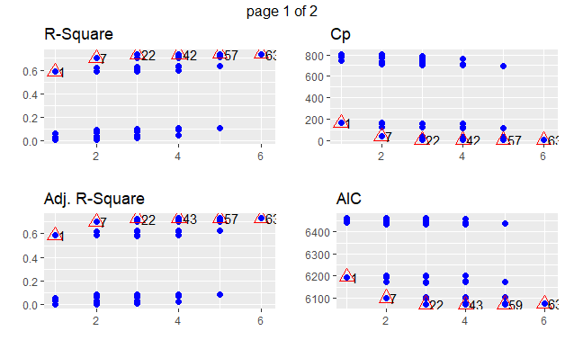

## ACKNOWLEDGEMENTS

"I am not what happened to me, I am what I choose to become"
by Christopher Gardner, The Pursuit of Happiness.

It is always a pleasure to remember the fine people who guided us in the Regression program. We received to uphold our practical and theoretical skills during the respective session. Firstly, we would like to thank **Pro. James C. Dickens** and secondly, we want to thank our family & friends for their love, motivation, and support during this semester in American university. Thanks for all the ideas, opinions, knowledge, and suggestions given to us to help us  complete this report. We are very thankful to American University for giving us the opportunity to pursue this project.

***
\newpage

# Title Page with Executive Summary

**Title:** Estimating Medical Cost via random forest.

**Type of analysis:** Application analysis

**Table 1:**
<table>

Name                                   course
-------------                        ---------
Dhruv Jain                            STAT -615
Mekdim Ashebo                         STAT -615

</table>


```{r,warning=FALSE,message=FALSE }
# calling all the libraries used in the code book 
# Install this for latex pdf output. 
#tinytex::install_tinytex()
library(olsrr)
library(tidyverse)
library(dbplyr)
library(dplyr)
library(Matrix)
library(MASS)
library(ggplot2)
library(tibble)
library(data.table)
library(ggmosaic)
library(ggforce)
library(ggmap)
library(ggthemes)
library(purrr)
library(keep)
library(readr)
library(gridExtra)
library(randomForest)
library(corrplot)
library(PerformanceAnalytics)

```

# 1 All About Data Set 

## 1.1 Data Set Source 

**Summary:** The type of analysis is **application based**. 
This data set is collected from different open-source databases manually. offer a preliminary description of the data set. For example, indicate the size of the data source, describe the variables, and include any other data profile information that would be of interest.


**Data source**: **website name**:Kaggle. 
[Website link](https://www.kaggle.com/datasets/mirichoi0218/insurance)


**Overall approach** is Cleaning, analyzing, again cleaning, answering the five questions, playing with data to deliver more better output and finally graphical representation. **Defining** the issues and trying to resolve that by presenting the medical cost data set . **Measure** overall what can be done. **Analyze** the data to use for future capability. **Improving** You will use information gathered in the previous phases to design and implement improvements in processing with consistency. Overall Approach to this question is using various tools and coding sets with providing the statistical data with convincing evidence.  

Clean --> Design --> Plot –-> Types Regression model  --> hypothesis --> statistical findings --> Random forest --> conclusion   


**Recommendations:** Using R-studio markdown one can achieve high graphical results with better quality and one can also conclude that big data can be easily handled on this platform. Using this platform, we will continue to evaluate the medical cost for personal data using this tool. The issue is that what can be done with the data can we provided some explanation to justify the results. We would like to address those five questions with different visual ideas. 

**IMPORTANT KEYWORDS:  **

-  charges 
-  Smoker 
-  sex 
-  BMI (body mass index)  
-  P-value 
-  Random forest


**Columns Description**

**age**: age of primary beneficiary
**sex**: insurance contractor gender, female, male
**bmi** Body mass index, providing an understanding of body, weights that are relatively high or low relative to height, objective index of body weight (kg / m ^ 2) using the ratio of height to weight, ideally 18.5 to 24.9.
**children**: Number of children covered by health insurance / Number of dependents
**smoker**: Smoking
**region**: the beneficiary's residential area in the US, northeast, southeast, southwest, northwest.
**charges**: Individual medical costs billed by health insurance


We had to randomly sample 300 rows from our original data.
We then saved these 300 rows into csv file so that we can import them later.
going forward We will take that csv file. (which has only be run once)

```{r}
# The preliminary steps we did 
#insurance <- read_csv('Downloads/insurance.csv')
#insurance_300 <- sample_n(insurance, 300)
#write.csv(insurance_300 , file = "Desktop/insurance_300.csv")
```


```{r}
insurance_new <- read_csv("insurance_300.csv", 
col_types = cols(
  age = col_double(),
  sex = col_character(),
  bmi = col_double(),
  children = col_double(),
  smoker = col_character(),
  region = col_character(),
  charges = col_double()
))
```


-  The data contains 300 rows  and 7 columns. This project is about determining the factors that affect medical costs billed by health insurance.

-  The independent variables include three categorical variables and three quantitative variables.Sex (male/female), region(Northeast, northwest etc), and smoker(whether a person smokes or not) are the categorical variables. While the quantitative variables include the BMI index, the age and the number of children the person have.

```{r}
head(insurance_new,8)
```

```{r}
nrow(insurance_new)
ncol(insurance_new)
colnames(insurance_new)

```

-   Let us quickly investigate the summary of our dependent variable. The median insurance charge is around 10097 and the mean of 13283. The standard deviation is 11399.

```{r}
summary(insurance_new)
```

-   Type of columns used in data frame (double, charterer)
```{r}
str(insurance_new)
```


## 1.2  Cleaning the data and type of columns    

```{r}
# calculating NA/missing data in columns 
colSums(is.na(insurance_new))
# converting to factor variable 
insurance_new$sex = as.factor(insurance_new$sex)
insurance_new$smoker = as.factor(insurance_new$smoker)
# how many unique values 
unique(insurance_new$sex)
unique(insurance_new$children)
unique(insurance_new$smoker)
unique(insurance_new$region)
# Check levels of smoker variable
table(insurance_new$smoker)
# Check levels of region variable
table(insurance_new$region)
# Check levels of sex variable
table(insurance_new$sex)

```

## 1.3 Visualization

### 1.3.a  Does age affect medical charges for smoker? 
```{r, fig.cap= "Scatter plot for charges vs Age", warning=FALSE, echo=FALSE}

ggplot(data = insurance_new , 
       aes(x=age, y=charges,shape=smoker,color = smoker)) +
  geom_point()+
  geom_smooth(method=lm)+
  ggtitle("Scatter plot for charges vs Age")

```
-   Yes the charges are increased as we increase the number of age. Now the fun part is if a person smokes he/she is paying more charges on medical then the person not smoking.

### 1.3.b  Does Body mass index (BMI) affect medical charges for smoker? 
```{r, warning=FALSE, echo=FALSE}
ggplot(data = insurance_new , 
       aes(x=bmi, y=charges,shape=smoker,color = smoker)) +
  geom_point()+
  geom_smooth(method=lm)
```
-   One can clearly observe that smoking affect in BMI and increased  with the medical expenses.

### 1.3.c  Histogram for density graph for Body mass index (BMI)  
```{r,warning=FALSE, echo=FALSE}
ggplot(data = insurance_new , aes(x=bmi,color=sex)) +
 geom_histogram(aes(y=..density..), colour="black", fill="white")+
 geom_density(alpha=.2, fill="#FF6666")
```
-   The graph is density vs body mass index for male and female counts in the data set.

### 1.3.d  High no. of smokers from which region ? 
```{r,warning=FALSE, echo=FALSE}
ggplot(data = insurance_new , 
       aes(x=region, y=charges,shape=smoker,fill = smoker)) +
  geom_boxplot(color="black")+
  geom_smooth(method=lm)+
  theme_classic()+
  theme(legend.position="bottom")+
  geom_jitter(shape=16, position=position_jitter(0.2))
```
-   comparing that does region of living affects the smokers or not. Now, looking at graph one cans say that the region does affect the charges on medical insurance. 

### 1.3.e
```{r,warning=FALSE, echo=FALSE}
# How many children per male/female.
ggplot(data = insurance_new , aes(x=children,color=sex)) +
 geom_histogram()
```


##  1.4  No. of counts 
```{r}
# Female 
insurance_new%>%
  filter(sex == "female")%>%
  count(sex,children,smoker,region)%>%
  arrange(sex, smoker) -> counts

head(counts,n=5)

# Male 
insurance_new%>%
  filter(sex == "male")%>%
  count(sex,children,smoker,region)%>%
  arrange(sex, smoker) -> counts_male

head(counts_male,n=5)

```


# 2  QQ & Multicollinearity plot description 

## 2.1 Multicollinearity plot 

-    The response variable is not dependent on explanatory variable interns of multicollinearity.

-    The highest correlation is between charges and age with only 0.24. But if we exclude charges  since charges is dependent variable, the highest correlation among the independent variables.

-    The age with bmi with only 0.04 which is nearly 0. So there exists no colinearity among the independent variables. This suggests that each of the variables might be useful if they are included in the regression model as they dont have any correlation with each other. 
```{r}
numeric_insurance <- cor(insurance_new[,c("bmi", "children", "age", "charges")])

numeric_insurance
```

-    we can also the scatter plots between the independent variables clearly there is no pattern that we can see verifying our output from the correlation matrix. 

-    One can say from the graph that the points are independently plotted and one cannot find any kind of pattern on left side of graph. On the other hand one can identify the  

```{r fig.cap= "multicollinearity plot", warning=FALSE, echo=FALSE}
chart.Correlation(numeric_insurance, histogram=TRUE, pch=19)
```


## 2.2 Normality plot

```{r}
# Light tailed at the end 
qqnorm(insurance_new$bmi)
# right skewed 
qqnorm(insurance_new$charges)
# Heavy tailed at the end 
qqnorm(insurance_new$age)

```


# 3  Full Regression Model 

-    full regression model including both categorical and quantitative variables 
```{r}
lm(charges ~ age + children + bmi + region + sex + smoker,data = insurance_new) -> x
x
```

# 4 Matrix 

## 4.1  Fitted & Residual values using matrix for quantitative variables 

```{r}
Xm <-  model.matrix(~age + children + bmi   , data=insurance_new )
Ym <- as.matrix(insurance_new%>%dplyr::select(charges))
# Let's use R code to establish matrix X :
#------------------------------------------------------------------- 
#  A = (X^T*X)^-1*X^TY 
(solve(t(Xm)%*%Xm))%*%(t(Xm)%*%Ym)
#-------------------------------------------------------------------
# fitted values 
Xm%*%((solve(t(Xm)%*%Xm))%*%(t(Xm)%*%Ym)) -> fitted_values
#-------------------------------------------------------------------
# residual values 
Ym-Xm%*%((solve(t(Xm)%*%Xm))%*%(t(Xm)%*%Ym)) -> residual_values
#-------------------------------------------------------------------
# producing the table of residula and fitted plot for the model.
matrix = data.frame(fitted_values, residual_values)
names(matrix)[1] <- "fitted_values"
names(matrix)[2] <- "residual_values"
head(matrix, 6)
#-------------------------------------------------------------------
# Both fitted values and residual values match with matrix model  
lm(charges ~ age + children + bmi, data= insurance_new) -> AB
#summary(AB)
#residuals(AB)
#fitted(AB)
```

## 4.2  Matrix method with both quantitative and qualitative variables(dummy variables included automatically)

```{r}

# The results are the same using both the matrix method and lm method. 

Xm <-  model.matrix(~age + children + bmi + region + sex+ smoker  , data=insurance_new )
Ym <- as.matrix(insurance_new%>%dplyr::select(charges))

# Let's use R code to establish matrix X :
#------------------------------------------------------------------- 
#  A = (X^T*X)^-1*X^TY 
(solve(t(Xm)%*%Xm))%*%(t(Xm)%*%Ym)
#-------------------------------------------------------------------
# fitted values 
Xm%*%((solve(t(Xm)%*%Xm))%*%(t(Xm)%*%Ym)) -> fitted_values
#-------------------------------------------------------------------
# residual values 
Ym-Xm%*%((solve(t(Xm)%*%Xm))%*%(t(Xm)%*%Ym)) -> residual_values
#-------------------------------------------------------------------
# producing the table of residula and fitted plot for the model.
matrix = data.frame(fitted_values, residual_values)
names(matrix)[1] <- "fitted_values"
names(matrix)[2] <- "residual_values"
head(matrix,6)

#-------------------------------------------------------------------
# Both fitted values and residual values match with matrix model  
lm(charges ~ age + children + bmi+ region + sex + smoker, data= insurance_new) -> AB
#summary(AB)
#residuals(AB)
#fitted(AB)
```


# 5 Analyze and Evaluate the full model

```{r}
lm(charges ~ age + children + bmi+ region + sex + smoker, data= insurance_new) -> AB
summary(AB)

```
## 5.1 Coefficients:

### charges =  -12033.25 + (age)*261.14 + (children)*532.76 + (bmi)*353.35 + (region_northwest)(-1545.53) + (region_southeast)*(-1505.35) + (regionsouthwest)*(-1719.90) + (sexmale)*(607.78) + (smokeryes)*(22876.38)

-   The **Estimate column** lists the estimated coefficients of the predictor variables included in the model. For instance, the "age" coefficient has an estimated value of 261.14, which means that for every one-unit increase in age, the outcome variable (presumably a medical cost) is estimated to increase by $261.14, holding all other variables constant.

## 5.2  Standard Errors:
-   The **Std Error** column lists the standard errors of the estimated coefficients. These are measures of the uncertainty or variability in the estimated coefficients. Smaller standard errors indicate more precise estimates.

## 5.3 T-values:
-   The **t-value** column lists the t-statistics for each coefficient. These values represent the estimated coefficients divided by their standard errors. T-values are used to test the null hypothesis that the true coefficient is zero. Larger t-values indicate a stronger evidence against the null hypothesis.

## 5.4 P-values
-   The pr column lists the p-values associated with the t-values. P-values represent the probability of observing the t-value or a more extreme value if the true coefficient is zero. Smaller p-values indicate stronger evidence against the null hypothesis. 

-   The significance codes provided in the table help to quickly identify significant coefficients; for instance, **age,bmi,smokers** represents p-value less than two decimal places and **children** represents p-value less than 0.05.One can say that **region** represents bigger p-value than significant level. 

## 5.5 Residual Standard Error:
-   The **Residual standard error** provides an estimate of the variability of the errors or unexplained variance in the model. It measures the average distance that the observed values fall from the predicted values.

## 5.6 R-squared:
-   The "Multiple R-squared" and "Adjusted R-squared" measures how well the model fits the data. R-squared ranges from 0 to 1 and represents the proportion of variance in the outcome variable that is explained by the predictor variables. Adjusted R-squared is a corrected version of R-squared that takes into account the number of predictor variables in the model. In full model one can see 0.7379.

## 5.7 summary   
-   This data summary provides information on the estimated coefficients, their standard errors, t-values, and corresponding p-values, as well as model diagnostics such as residual standard error, multiple R-squared, adjusted R-squared, and F-statistic. These measures can be used to interpret the strength and significance of the relationship between the predictor variables and the outcome variable, as well as the overall goodness-of-fit of the model.
Still working to find the best parameters to be included in the model.   

#  6 Confidence intervals for all variables used in full model

-    These intervals provide a range of plausible values for the true population coefficients based on the sample data. The first column, "2.5%", represents the lower bound of the interval, and the second column, "97.5%", represents the upper bound of the interval.

-    The 95% confidence interval for the "age" variable is [213.81, 308.48]. This means that we are 95% confident that the true population coefficient for age falls within this range. Similarly, the confidence interval for the intercept is [-16276.39, -7790.11], which suggests that the expected value of the response variable (when all predictor variables are 0) is likely to be within this range.

```{r}
confint(AB,level = 0.95)
```
# 7  Full and Reduced Model for transformed variables with interaction terms

## 7.1  Evaluating Various regression models. 

-   Let us begin by using a multiple linear regression model that uses all the six variables. From the summary table we see that our R squared and Adjusted r square are around 0.73 and the  residual standard error is 5915.  The r squared value is high enough to be considered good but let us continue finding better fits. 

```{r}
ols_step_all_possible(AB) ->  allmodels
as_tibble(allmodels) -> allmodels_1
tail(allmodels_1,8)

# the best model is represented by including all age, children,bmi, region, smoker full model.

# plot(allmodels)
```

## 7.2 Finding Reduced and full model using interaction terms  

-    Let us see how r will create dummy variables for us using Region variable.
R will convert the categorical variables for us We can see R will do this automatically for us creating these dummy variables. Northeast is essentially the control variable. When the three variables are 0, it means that region is northeast! No need to bother here as R does this for us.

```{r}
contrasts(as.factor(insurance_new$region))

# Next step - Let us include all the interaction terms as well. Our residual standard error reduced. significantly to 4910. Our R squared also increased to 0.8331. 

lm(charges~ age + children + bmi + 
     region + sex + smoker + age:children + age:bmi + age:region + age:sex + age:smoker+
     children:bmi + children:region + children:sex + children:smoker
     + bmi:region + bmi:sex+ bmi:smoker + region:sex + region + smoker
   + sex:smoker, insurance_new) -> interactionModel
summary(interactionModel)


# Let us also see if transforming our dependent variable might help. Our R squared increased slightly
# but not much

lm(log(charges)~ age + children + bmi + 
     region + sex + smoker + age:children + age:bmi + age:region + age:sex + age:smoker+
     children:bmi + children:region + children:sex + children:smoker
   + bmi:region + bmi:sex+ bmi:smoker + region:sex + region + smoker
   + sex:smoker, insurance_new) -> interactionModel
summary(interactionModel)
```
## 7.3  Let us include interaction terms with transformed variables 

-   Let us add more interaction terms that include transformed x variables our y variable has been transformed here as well. Our r squared increased again to 0.8373 and the residual error is now 4839. It is better slightly but there are a lot of variables which are not significant. For example, sex:smoke interaction variable's p value is 0.7829 which is significantly above 0.05. In the next step, let us remove all those variables that are not significant 


```{r}
lm(charges~ age + children + bmi + 
     region + sex + smoker + age:children + age:bmi + age:region + age:sex + age:smoker+
      children:sex + children:smoker
   + bmi:region + bmi:sex+ bmi:smoker + region:sex + region + smoker
   + sex:smoker + log(bmi)+ bmi*bmi + log(age) + age*age + log(age)*log(bmi), insurance_new) -> interactionModel
summary(interactionModel)
```

## 7.4 Let Reduce the above models by eliminating some variables

-   remove interaction Terms or the single variables  whose p value is insignificant. For this case our starting model has a lot of variables so after removing many of the variables we will have a reduced model.

-   Those variables whose p value is too high should be removed and a reduced model has to be produced.we run the reduced model below our r squared slightly decreased to 0.8332 and the adjusted r squared to 0.8244. 

-   It is very small change to our previous step so it is fine to take this. The  p values are also significant so for that reason we chose this model. This could be one candidate model for our regression. 

```{r}
lm(charges~  children+bmi+smoker+age:children+age:region+
     age:smoker+children:smoker+bmi:region+bmi:smoker+smoker+log(bmi)+
     bmi*bmi + log(age),insurance_new) -> interactionModelSignificant
summary(interactionModelSignificant)
```

-   let also use the variables from the last step to establish model selection like we have covered in class R will use any combination of these variables to come up with r^2, cp values etc for each of them.we will order the result by r^2, then by adjusted then by cp and inspect if we should choose any other combination of the variables from above. 

-   As we can see the maximum r square values are around 0.833 (from 2047 models ) which aligns with our finding from above. So need to change anything. Since there are a lot of models whose r squared is 0.833 we might choose the one with the lowest cp. And that is the 6th row with cp of 5.16. The variables used are smoker log(bmi) log(age) age:region smoker:age children:smoker bmi:region bmi:smoker with 8 variables. So that could be an alternative reduced version of the model we have above. 

-   So going forward let me  choose the model from above. We felt it was good enough so now let us investigate more by analysing the residuals and the normality. 

```{r}
lm(charges~  children + bmi + 
     smoker + age:children + age:region + age:smoker+
     + children:smoker + bmi:region +  bmi:smoker + smoker
   +  log(bmi)+ bmi*bmi + log(age)  , insurance_new) -> interactionModelSignificant

summary(interactionModelSignificant)

# The residual plot is not perfect but there is no clear pattern. So it should be relatively fine. It indicates relatively good amount of constant variance.

# Observing the residual vs fitted plot one can say that more points are plotted in one area specifically and no pattern can be found. So its normallly distributed. 

resid(interactionModelSignificant) -> residuals1

plot(fitted(interactionModelSignificant), residuals1)+
abline(0,0)


```

## 7.5 CI for  two of our chosen quantitative variables 

-   Using this regression model Let us take at least two variables and find confidence interval for the independent variables.  Let us take two such as  log(age) and bmi for example. 

-   The standard error for log(age) is 1406.95 and the coefficient is 5125.69 and standard error for bmi is 454 and the coefficient is 1285.83 . 


-   Degree of freedom is 284. (300-16). t is 1.9683.  Which is closer to the z score actually.

```{r}
qt(p=.025, df=284, lower.tail = FALSE) -> t
t

# so for bmi 
#upper bound    2179.438
1285.83 + 1.9683 * 454
# lower bound   392.2218
1285.83 - 1.9683 * 454

# for log(age)
# upper bound ] 7894.99 
5125.69 + 1.9683 * 1406.95  
# lower bound 
5125.69 - 1.9683 * 1406.95 


```
# 8 

## 8.1 Researching and Applying a model analysis.

-   Here we will show how random forest model can be used on our full model or using  all explanatory variables to predict the dependent variable charges. 

-   Random forest works by using if-else decision trees using all variables. For example one possible path could be if a person is a non smoker, male and if he has a bmi value above 90, the medical charge should approximately be 1000. This is just to. show how it works under the hood but the actual mechanisms and branching rules are not as trivial as  my example. For a continuous dependent variable, we should use random forest regressor (it does regression but using random forest)

-   We will compare the root mean squared error using our random forest model and the regression we had above Random Forest Model.

```{r}
set.seed(42)
rf.fit <- randomForest(charges ~ ., data=insurance_new, ntree=3,
                    keep.forest=FALSE, importance=TRUE)
```


-   from fitting the random forest model, we can see that the root mean squared is 37712690^(0.5). Rf.fit gives us the squared value so we have to take the root of it to find the root mean square. so 37712690^(0.5) = 6141.066. This random forest model produced worse result than our regression model. 

-   we got a value of 4858 as our best root mean squared error from our regressoin model.

-   But also just like we can tune our regression model, we can also tune our random forest model. Let us increase the number of trees from 3 to 300 in the random forest model. we get 25902511^(0.5) = 5089.451. So as we increase our number of trees the root mean squared approached our best regression model out put. Of course we can tune a lot of things in the decision trees of random forest as well so random might give us a root mean square value less than our regression model. 

-   The variability explained by this random forest model was also close to what we have in the regression model. It is 80% here. 

```{r}
rf.fit

rf.fit <- randomForest(charges ~ ., data=insurance_new, ntree=300,
                       keep.forest=FALSE, importance=TRUE)
rf.fit
```

-   Let also this which variables were important according to the latest random forest model.

-   we had. We see that smoker variable was very important in terms of information gain( it is one of the best variable used in the decision tree and is found to be important interms of determining medical charges/bills. The other variables that are found important are age and BMI as we see from the diagram.) children, region and sex had minimal impact compared to the other variables. 


```{r}

ImpData <- as.data.frame(importance(rf.fit))
ImpData$Var.Names <- row.names(ImpData)

ggplot(ImpData, aes(x=Var.Names, y=`%IncMSE`)) +
  geom_segment( aes(x=Var.Names, xend=Var.Names, y=0, yend=`%IncMSE`), color="skyblue") +
  geom_point(aes(size = IncNodePurity), color="blue", alpha=0.6) +
  theme_light() +
  coord_flip() +
  theme(
    legend.position="bottom",
    panel.grid.major.y = element_blank(),
    panel.border = element_blank(),
    axis.ticks.y = element_blank()
  )


```

# 9 Final summary
- As we can see  from most of our graphs, out of the 6 variables we have we found that age, BMI and smoker variables were the explanatory variables that affected the value of our dependent variable charge the most. From our final regression model we chose, we can also see that the p values for bmi, log(age), smoker, and the interaction term bmi*smoker etc were very small values showing that they were significant. Even from preliminary visual plots(1.3b), we have seen how the interaction of BMI with smoker could change the value of charges. A smoker with high BMI typically has higher charges. As we would expect, our random forest model also gave us similar conclusion when it comes to choosing the most important explanatory variables as depicted in the random forest model plot showing the important variables. So based on our regression models, preliminary visual plots and random forest model we conclude that an old smoker person who has a high BMI would likely pay the highest medical charges. 

- It was also important to note that our random forest model performed very similar to our best regression model in terms of r squared (80-82 %) and in terms of residual error or root mean square(4900-5000). However, we have tried several regression model when we use the function ols_step_all_possible and insert several interaction terms and transformed functions. By using that function we have tried over 1000 different models and choose the best one. However, we only played with two or three random forest models since they are typically slower. If we have used different tuning for our random forest model, we might have got even better r squared and smaller root mean squared error

```{r}
# 


```

